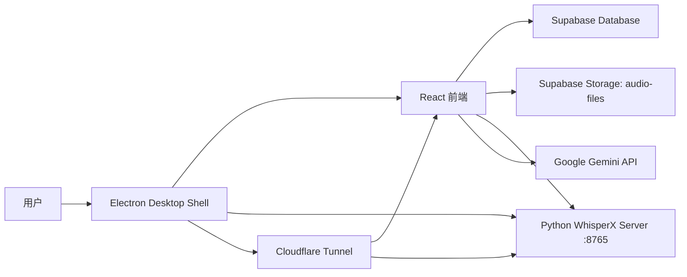

# PodFluent / EnglishPod Learner Feature 文档

本文档基于当前本地仓库代码整理，用于后续版本迭代、需求拆分和范围确认。

## 1. 产品定位

PodFluent 是一个面向英语播客学习的桌面优先应用。它允许用户导入音频或视频文件，自动生成英文转写稿和时间戳，在播放器中跟随音频高亮字幕，并通过点击单词生成 AI 生词卡。

当前实现更接近“个人本地学习工具 + 可远程访问的私有 Web 入口”，而不是完整多用户 SaaS。

## 2. 当前产品范围

### 2.1 核心用户目标

- 导入英语播客、课程录音、采访或视频音轨。
- 自动获得按句子、说话人、单词级时间戳组织的转写稿。
- 播放音频时同步浏览字幕。
- 点击不认识的单词，生成解释、音标、例句、中文释义和上下文。
- 保存和复习生词。
- 在本地桌面运行 AI 转写引擎，也能通过远程地址访问已处理内容。

### 2.2 主要入口

- `Library`：播客资源库、导入、处理、删除、进度查看。
- `Player`：音频播放、字幕同步、生词生成。
- `Vocabulary`：生词列表、搜索、展开详情、朗读、删除。
- `Settings`：Gemini Key、模型、Whisper 模型选项、远程访问、转写 Prompt、后端日志。

## 3. 技术栈与运行形态

### 3.1 前端

- React 19
- Vite
- React Router HashRouter
- Zustand 持久化本地设置
- CSS Modules + 全局 CSS 变量
- lucide-react 图标

### 3.2 桌面壳

- Electron
- `electron/main.cjs` 负责：
  - 创建桌面窗口。
  - 启动 Python WhisperX 服务。
  - 转发 Python 后端日志到前端。
  - 启停 Cloudflare Tunnel。
  - 打包后启动本地静态 HTTP 服务。

### 3.3 AI 与数据服务

- Google Gemini：音频转写 fallback、生词卡生成。
- WhisperX Python 服务：本地优先转写、单词级时间戳、可选说话人分离。
- Supabase：
  - Database：`podcasts`、`transcripts`、`vocabulary`。
  - Storage：`audio-files` bucket 保存原始音频文件。
  - Realtime：资源库和生词本订阅变化。

### 3.4 本地数据

- Zustand localStorage：保存 API Key、模型、Prompt、远程访问开关等设置。
- Dexie IndexedDB：代码中存在 `EnglishPodLearnerDB`，但当前主要业务没有实际使用，属于历史方案或预留。

## 4. 系统架构



## 5. Feature 清单

### F01. 应用外壳与导航

当前能力：

- 左侧固定导航栏展示品牌 `PodFluent`。
- 提供 Library、Vocabulary、Settings 三个主导航。
- Settings 在未设置 Gemini API Key 时展示提醒红点。
- Electron 窗口顶部有可拖拽区域。
- 播放器页面以全屏工作区形式覆盖主布局。

涉及文件：

- `src/App.jsx`
- `src/main.jsx`
- `src/components/Layout.jsx`
- `src/components/Layout.module.css`

可迭代方向：

- 增加移动端/窄屏适配。
- 增加面包屑、最近播放、当前处理任务提醒。
- 将 UI 文案统一为中文、英文或双语。

### F02. 远程访问门禁

当前能力：

- 非 Electron 环境会显示密码门禁。
- 密码正确后写入 `sessionStorage`，当前浏览器会话内免重复输入。
- 最多 5 次错误，错误后锁定 5 分钟，状态写入 `localStorage`。

涉及文件：

- `src/App.jsx`
- `src/components/PasswordGate.jsx`

已知限制：

- 远程访问密码已改为 `VITE_REMOTE_ACCESS_PASSWORD`，但仍属于前端门禁，不等同于完整账号体系。
- 远程访问没有真正的用户账号、权限、审计日志。

可迭代方向：

- 改成服务端校验或 Supabase Auth。
- 为远程访问增加访问日志、设备白名单、临时分享链接。
- 从环境变量或配置文件读取访问密码。

### F03. 播客资源库

当前能力：

- 从 Supabase `podcasts` 表拉取播客列表。
- 按创建时间倒序展示。
- 展示标题、创建日期、状态、处理进度、错误信息。
- 空状态提示用户导入音频。
- 支持 Supabase Realtime 订阅变化。
- 另有 3 秒轮询兜底刷新。
- 本地桌面模式显示导入和删除操作。
- Web 模式隐藏导入、处理、删除等本地操作。

涉及文件：

- `src/features/dashboard/DashboardPage.jsx`
- `src/services/podcast.js`

状态枚举：

- `PENDING`
- `PROCESSING`
- `READY`
- `ERROR`

可迭代方向：

- 增加处理队列视图。
- 增加音频时长、文件大小、来源、学习进度。
- 支持批量导入、批量删除。
- 支持按状态、日期、标题过滤。

### F04. 文件导入与上传

当前能力：

- 支持 `audio/*,video/*` 文件选择。
- 上传原始文件到 Supabase Storage `audio-files` bucket。
- 上传成功后在 `podcasts` 表插入记录。
- 文件名当前使用 `Date.now()` 生成，保留原始扩展名。
- 导入后若已设置 Gemini API Key，会自动开始处理。
- 未设置 API Key 时提醒用户去 Settings 配置。

涉及文件：

- `src/features/dashboard/DashboardPage.jsx`
- `src/services/podcast.js`
- `src/lib/supabase.js`

可迭代方向：

- 上传前检查文件大小、格式、重复文件。
- 保留原始文件名、时长、MIME、hash。
- 增加上传进度条和取消上传。
- 支持从 URL、RSS、YouTube 或本地目录导入。

### F05. 播客转写处理

当前能力：

- 处理开始时将播客状态更新为 `PROCESSING`。
- 读取播客 `audio_url` 并拉取为 Blob。
- 优先等待本地 WhisperX 服务可用。
- WhisperX 最多重试 30 次，每 2 秒一次。
- WhisperX 可用时调用 `/transcribe`。
- WhisperX 失败或无结果时 fallback 到 Gemini。
- Gemini 支持大文件分片、分片重叠、结果合并和简单去重。
- 转写结果写入 Supabase `transcripts` 表。
- 成功后将播客状态更新为 `READY`。
- 失败后将播客状态更新为 `ERROR` 并保存错误信息。

涉及文件：

- `src/services/podcast.js`
- `src/lib/whisperx.js`
- `src/lib/gemini.js`
- `python/align_server.py`

输出结构：

```json
{
  "segments": [
    {
      "start": 0,
      "end": 5.2,
      "speaker": "Speaker 1",
      "text": "Sentence text.",
      "words": [
        { "word": "Sentence", "start": 0, "end": 0.6 }
      ]
    }
  ]
}
```

可迭代方向：

- 将处理任务抽象为可恢复队列。
- 将每一步处理状态结构化，而不是只写字符串 `progress`。
- 支持重新转写、只重跑对齐、只重跑说话人分离。
- 记录模型版本、耗时、成本、失败原因。
- 允许用户选择是否使用 Gemini fallback。

### F06. 本地 WhisperX 引擎

当前能力：

- Flask 服务运行在 `http://localhost:8765`。
- `/health` 返回设备、模型、compute type、diarization 状态。
- `/transcribe` 接收音频文件并执行：
  - Whisper 转写。
  - 英文 alignment。
  - 可选 speaker diarization。
  - 输出 segment 和 word timestamps。
- `/align` 提供 legacy 对齐接口。
- 启动时自动判断 CUDA 或 CPU。
- CUDA 下使用 `float16`，CPU 下使用 `int8`。
- 默认 Whisper 模型来自环境变量 `WHISPER_MODEL`，未设置时使用 `small`。
- 如果存在 `HF_TOKEN`，尝试加载 pyannote speaker diarization。
- Electron 启动时自动拉起该 Python 服务，并把日志推送到前端。

涉及文件：

- `python/align_server.py`
- `python/requirements.txt`
- `python/requirements_windows.txt`
- `python/run_engine_windows.bat`
- `electron/main.cjs`
- `src/components/LogViewer.jsx`

已知限制：

- Settings 保存 Whisper 模型后会通知 Electron 重启 Python 引擎；Web 模式不支持本地模型切换。
- 长音频处理没有任务取消、排队、超时保护。
- 后端日志仅在 Electron IPC 内展示，Web 模式无同等日志能力。

可迭代方向：

- 增加 `/config` 或启动参数传入模型选择。
- 增加任务 ID、进度事件、取消任务、并发限制。
- 支持模型预热状态和资源占用提示。
- 将转写服务独立成稳定后台进程或本地 API。

### F07. Gemini 转写 fallback

当前能力：

- 通过 `@google/generative-ai` 调用 Gemini。
- 默认模型来自设置，默认值为 `gemini-2.0-flash-exp`。
- 小于 10MB 的文件直接 inline base64 发送。
- 大文件按 10MB 分片，200KB overlap。
- 对分片结果做时间偏移和重复片段去重。
- 如果 Gemini 没有返回单词时间戳，会按单词长度在句子时长内插值。
- 支持 `DEMO_KEY` 返回 demo transcript。

涉及文件：

- `src/lib/gemini.js`

已知限制：

- 自定义转写 Prompt 已接入 Gemini fallback；WhisperX 本地转写不使用该 Prompt。
- 分片时间偏移基于 128kbps 估算，长音频或可变码率音频可能出现时间漂移。
- Gemini 生词卡固定使用 `gemini-2.0-flash-exp`，不跟随设置中的模型。

可迭代方向：

- 使用真实音频时长或解码信息计算分片时间。
- 让用户明确选择转写模型和生词模型。
- 为 WhisperX 增加更细的语言、任务和热词配置。
- 对 Gemini 响应做更严格 schema 校验和修复。

### F08. 播放器与字幕学习

当前能力：

- 根据路由 `player/:id` 加载播客和转写稿。
- 使用 HTML `<audio>` 播放 Supabase 公共音频地址。
- 支持播放/暂停、后退 5 秒、前进 5 秒、拖动进度条。
- 展示当前时间和总时长。
- 按当前播放时间高亮 active segment。
- 有单词级时间戳时，高亮 active word。
- 当前 segment 自动滚动到视口中间。
- 点击单词会 seek 到该词开始时间，并暂停播放。

涉及文件：

- `src/features/player/PlayerPage.jsx`
- `src/features/player/TranscriptView.jsx`
- `src/hooks/useAudioPlayer.js`

可迭代方向：

- 增加倍速、A-B 循环、句子循环、快捷键。
- 增加上一句/下一句、逐句听写、隐藏字幕模式。
- 增加播放进度持久化。
- 增加 transcript 编辑和人工修正。

### F09. 生词卡生成

当前能力：

- 点击播放器里的单词后生成生词卡。
- 自动带入原句作为上下文。
- 调用 Gemini 返回：
  - word
  - definition
  - ipa
  - examples
  - translation
- 防重复逻辑：同一个 word + source_podcast_id 已存在时直接返回旧记录。
- 写入 Supabase `vocabulary` 表。
- 播放器右侧展示生词卡面板。
- 支持浏览器 SpeechSynthesis 朗读单词和例句。

涉及文件：

- `src/features/player/PlayerPage.jsx`
- `src/services/vocab.js`
- `src/lib/gemini.js`

已知限制：

- 生词服务会优先保存 `ipa`、`translation`、`examples`，如果旧 Supabase 表缺少扩展列会自动回退到基础字段。
- 已做基础大小写和边界标点归一化，但复杂词形变化仍可能造成重复。

可迭代方向：

- 扩展 vocabulary schema，保存 IPA、例句、中文释义、熟练度、复习记录。
- 增加词形归一、短语识别。
- 增加“已会/收藏/困难/复习中”等学习状态。
- 引入间隔重复复习。

### F10. 生词本

当前能力：

- 从 Supabase `vocabulary` 表读取所有生词。
- 按创建时间倒序展示。
- 支持按英文单词和释义搜索。
- 点击卡片展开上下文。
- 支持朗读单词。
- 支持删除生词。
- 订阅 Supabase Realtime 变化。

涉及文件：

- `src/features/vocabulary/VocabularyPage.jsx`
- `src/services/vocab.js`

可迭代方向：

- 增加来源播客跳转和定位原句。
- 增加复习模式、测验模式、导出 Anki/CSV。
- 增加按来源、日期、熟练度过滤。

### F11. 设置中心

当前能力：

- 保存 Gemini API Key 到本地 Zustand persist。
- 选择 Gemini 模型：
  - `gemini-2.0-flash-exp`
  - `gemini-1.5-flash`
  - `gemini-3-flash-preview`
- 本地模式下选择 Whisper 模型：
  - `small`
  - `medium`
- 本地模式下开关 Remote Access。
- 保存自定义转写 Prompt。
- 提供一键重置默认 Prompt。
- 展示后端日志。

涉及文件：

- `src/features/settings/SettingsPage.jsx`
- `src/store.js`
- `electron/main.cjs`

已知限制：

- Gemini API Key 只做非空校验，`AIza` 前缀提示没有实际阻断。
- Whisper 模型切换需要重启本地 Python 引擎，保存设置后 Electron 会自动处理。
- Remote Access 开关依赖 Electron IPC 和本机 Cloudflare 配置。

可迭代方向：

- 设置项分组保存并展示生效状态。
- 增加 API Key 测试按钮。
- 增加模型能力说明、费用估算。
- 增加设置导入/导出和重置。

### F12. 后端日志与运行状态

当前能力：

- Electron 主进程读取 Python stdout/stderr。
- 前端通过 IPC 接收 `server-log` 和 `backend-status`。
- LogViewer 默认折叠。
- 显示最近 100 条日志。
- 自动识别启动阶段：
  - starting
  - initializing
  - loading_whisper
  - loading_alignment
  - loading_diarization
  - ready
  - error
- 支持清空前端日志。

涉及文件：

- `electron/main.cjs`
- `src/components/LogViewer.jsx`

可迭代方向：

- 增加日志级别过滤。
- 增加复制日志、导出诊断包。
- 增加后端健康检查面板。

### F13. 远程访问与 Cloudflare Tunnel

当前能力：

- Settings 中启用 Remote Access 后，Electron 通过 IPC 启动 `cloudflared tunnel run podfluent`。
- 打包生产模式下，Electron 会启动本地静态 HTTP 服务，监听 `0.0.0.0:5173`。
- `cloudflared-config.yml` 映射：
  - `podcast.example.com` -> `localhost:5173`
  - `api.example.com` -> `localhost:8765`

涉及文件：

- `electron/main.cjs`
- `cloudflared-config.yml`
- `start-tunnel.bat`

已知限制：

- 依赖本机安装 `cloudflared` 并配置 tunnel credentials。
- 远程访问密码来自 `VITE_REMOTE_ACCESS_PASSWORD`。
- Python API 远程暴露后缺少独立鉴权。

可迭代方向：

- 增加 Tunnel 状态检测和错误提示。
- 对 Python API 增加 token 校验。
- 提供二维码或复制远程访问链接。

### F14. 构建与分发

当前能力：

- `npm run dev`：启动 Vite。
- `npm run build`：构建 Electron 使用的 `dist/`。
- `npm run build:web`：构建 Web 使用的 `dist-web/`。
- `npm run electron:dev`：并发启动 Vite 和 Electron。
- `npm run electron:build`：构建并用 electron-builder 输出 Windows x64 目录包。
- Electron build 将 `python/**` 作为 extraResources。

当前验证：

- `npm run build` 通过。
- `npm run lint` 失败，原因包括生成目录、静态原型目录和主应用源码中的 lint 问题。

可迭代方向：

- 配置 ESLint 忽略 `dist/`、`dist-web/`、`release/`、静态原型目录。
- 增加 CI：build、lint、基础 smoke test。
- 增加正式安装包目标，而不仅是 Windows dir target。

## 6. 数据模型梳理

### 6.1 Supabase Storage

Bucket：

- `audio-files`

用途：

- 保存用户导入的音频/视频文件。
- 当前返回 public URL 供前端播放和处理。

### 6.2 `podcasts`

代码中使用字段：

| 字段 | 用途 |
| --- | --- |
| `id` | 播客 ID |
| `title` | 文件名或标题 |
| `status` | `PENDING` / `PROCESSING` / `READY` / `ERROR` |
| `audio_url` | Supabase Storage public URL |
| `created_at` | 创建时间 |
| `progress` | 处理进度文案 |
| `error` | 处理失败信息 |

### 6.3 `transcripts`

代码中使用字段：

| 字段 | 用途 |
| --- | --- |
| `podcast_id` | 关联播客 |
| `content` | JSONB，保存 segments 数组 |

### 6.4 `vocabulary`

代码中使用字段：

| 字段 | 用途 |
| --- | --- |
| `id` | 生词 ID |
| `word` | 单词 |
| `meaning` | 英文解释 |
| `context_sentence` | 来源句子 |
| `source_podcast_id` | 来源播客 ID |
| `created_at` | 创建时间 |
| `ipa` | UI 有读取，但插入时未保存 |

建议扩展字段：

- `translation`
- `examples`
- `normalized_word`
- `part_of_speech`
- `difficulty`
- `review_state`
- `last_reviewed_at`
- `next_review_at`
- `source_segment_start`
- `source_segment_end`

## 7. 关键用户流程

### 7.1 导入并处理播客

1. 用户在 Library 点击 Import Podcast。
2. 选择音频或视频文件。
3. 前端上传文件到 Supabase Storage。
4. 前端写入 `podcasts` 表，状态为 `PENDING`。
5. 如果已有 Gemini API Key，自动进入处理。
6. 状态更新为 `PROCESSING`。
7. 前端拉取音频 Blob。
8. 检查本地 WhisperX 服务。
9. WhisperX 成功则保存转写结果。
10. WhisperX 不可用或失败则用 Gemini fallback。
11. 写入 `transcripts` 表。
12. 播客状态变为 `READY`。
13. 用户点击卡片进入 Player。

### 7.2 播放与学习单词

1. 用户进入 Player。
2. 前端加载播客元数据和 transcript。
3. 用户点击播放。
4. `currentTime` 推动字幕 segment 和 word 高亮。
5. 用户点击某个单词。
6. 播放器 seek 到单词时间并暂停。
7. Gemini 根据单词和原句生成词卡。
8. 词卡写入 Supabase `vocabulary`。
9. 右侧面板展示词卡。
10. 生词本实时同步出现该单词。

### 7.3 开启远程访问

1. 用户在 Settings 设置 Remote Access 为 Enabled。
2. 前端通过 Electron IPC 发送 `toggle-remote-access`。
3. Electron 主进程启动 `cloudflared tunnel run podfluent`。
4. 外部设备访问你的 Cloudflare Tunnel hostname。
5. Web 环境先进入 PasswordGate。
6. 密码通过后访问已处理内容。

## 8. 本地模式与 Web 模式差异

| 能力 | Electron 本地模式 | Web/远程模式 |
| --- | --- | --- |
| 密码门禁 | 不需要 | 需要 |
| 导入文件 | 支持 | 隐藏 |
| 删除播客 | 支持 | 隐藏 |
| 手动处理 | 支持 | 隐藏 |
| Python 日志 | 支持 IPC 展示 | 不支持 |
| Remote Access 设置 | 支持 | 隐藏 |
| 播放已处理音频 | 支持 | 支持 |
| 查看生词 | 支持 | 支持 |

## 9. 已知风险与技术债

### 9.1 安全

- `.env` 被 Git 忽略，`HF_TOKEN`、Supabase 配置、远程访问密码应只保存在本机环境文件中。
- Supabase URL 和 anon key 已改为环境变量，仍需要配合 RLS 策略。
- Python API 经 Cloudflare 暴露后缺少 API 鉴权。
- 当前没有用户隔离，不适合多人共享真实学习数据。

### 9.2 配置与功能接线

- Whisper 模型切换依赖 Electron 重启本地 Python 服务，Web 模式不支持。
- 生词模型固定使用 `gemini-2.0-flash-exp`。
- 运行环境判断已集中到 `src/lib/env.js`，后续新增入口应继续复用该 helper。

### 9.3 数据一致性

- `PodcastStatus` 在 `src/db/index.js` 是小写，在 `src/services/podcast.js` 是大写。
- 部分 CSS 根据小写状态选择器上色，但业务写入大写状态。
- 删除播客只删除 podcast 记录和 storage 文件，转写是否级联依赖数据库约束。
- 新 schema 支持持久化 IPA、例句、中文释义；旧 schema 会自动回退到基础字段。

### 9.4 前端质量

- `npm run build` 通过。
- 主应用 `eslint` 仍有错误，包括未使用变量、React Hooks 新规则、`process` 未定义等。
- `npm run lint` 当前还会扫描 `dist-web` 和静态原型目录，导致噪音很大。
- `App.css` 仍是 Vite 模板遗留样式，当前主应用未明显使用。
- CSS 变量存在新旧命名混用，例如 `--bg-app` 与 `--bg-primary`。

### 9.5 文案与编码

- 多个中文文案显示为乱码，尤其是 PasswordGate、Cloudflare 配置注释、部分 demo 目录。
- 主应用 UI 目前英文为主，局部中文或乱码混杂。

## 10. 推荐迭代路线

### V0.1 稳定化

- 保持 ESLint 配置忽略构建产物和无关原型目录。
- 持续修复主应用 lint 错误。
- 持续清理中英文文案。
- 保持运行环境判断集中在 `src/lib/env.js`。
- 不提交 `.env`、Cloudflare credentials、Hugging Face token。
- 保持状态枚举大小写和 CSS 状态样式一致。

### V0.2 学习闭环

- 使用扩展 schema 持久化生词 IPA、例句、中文释义。
- 增加生词来源跳转到播放器原句。
- 增加播放进度保存。
- 增加倍速、句子循环、快捷键。
- 增加生词复习状态和基础测验。

### V0.3 转写体验

- 为 WhisperX 增加更多可配置项。
- 增加处理队列和可取消任务。
- 增加重新转写、重新对齐、重新生成词卡。
- 保存模型、耗时、成本、错误详情。

### V0.4 远程与同步

- 引入正式认证。
- 为远程 Python API 增加 token 校验。
- 支持远程只读分享链接。
- 增加设备访问日志。
- 建立 Supabase RLS 策略和用户数据隔离。

### V0.5 内容扩展

- 支持 RSS 订阅导入。
- 支持 YouTube/网页音频导入。
- 支持自动拆分章节。
- 支持 transcript 编辑和导出 SRT/VTT/Markdown。
- 支持导出生词到 Anki/CSV。

## 11. 仓库内附属静态原型

当前根目录还有几个未跟踪的静态原型目录，它们不是 PodFluent 主应用依赖的一部分：

| 目录 | 内容判断 |
| --- | --- |
| `audit-ai-platform/` | 审计智能辅助平台静态 UI 原型，包含工作台、数据导入、审计分析、AI Copilot 等页面 |
| `car-hud-dashboard/` | 汽车 HUD 仪表盘静态动画原型 |
| `rocket-launch-console/` | 火箭发射监控大屏静态原型，包含 left/center/right 三屏 |
| `audit-ai-platform.zip` | 审计原型压缩包 |

建议：

- 如果它们不是本项目需求，移动到单独仓库或 `archive/`。
- 如果要保留，更新 ESLint 和构建配置，避免被主应用工具链扫描。
- 为主应用补充真实 README，替换当前 Vite 模板 README。

## 12. 后续需求池模板

建议后续新增需求时使用以下字段：

| 字段 | 说明 |
| --- | --- |
| Feature ID | 例如 `F08-ABLoop` |
| 所属模块 | Library / Player / Vocabulary / Settings / Engine / Remote |
| 用户故事 | 作为某类用户，我希望完成什么，以便获得什么价值 |
| 当前问题 | 现在哪里不顺或缺失 |
| 验收标准 | 可测试的完成条件 |
| 数据改动 | 是否需要新增表、字段、索引、迁移 |
| API 改动 | 是否影响 Supabase、Python、Gemini 调用 |
| 风险 | 成本、性能、安全、兼容性 |
| 优先级 | P0 / P1 / P2 |
| 版本目标 | V0.1 / V0.2 / V0.3 |
